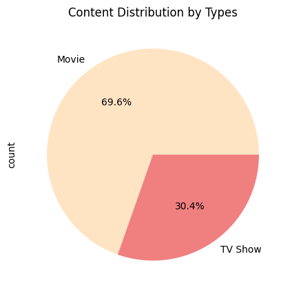
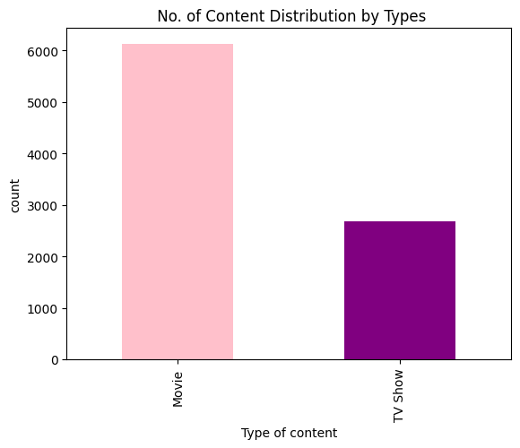
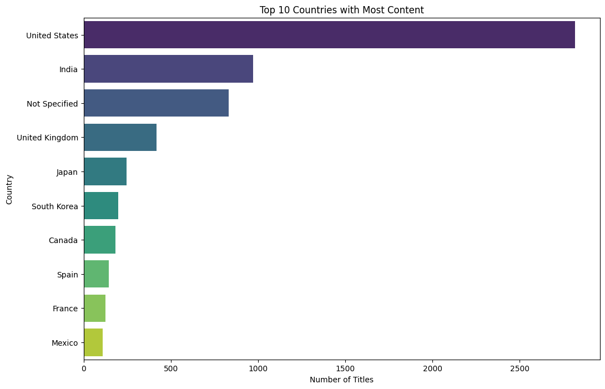
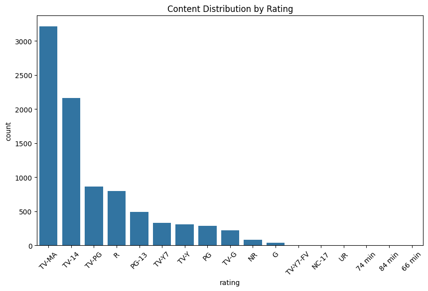
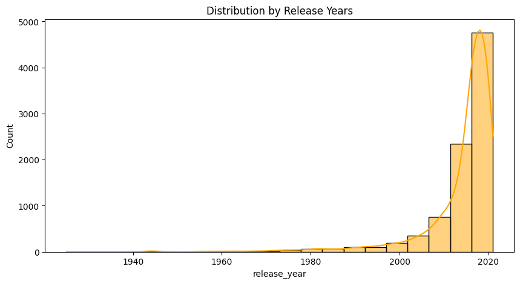

# Netflix Movies & TV Shows — Exploratory Data Analysis


An exploratory data analysis (EDA) of the Netflix catalogue using Python. The notebook inspects the raw titles data, treats missing values, and visualizes the mix of movies and TV shows, the countries behind them, their maturity ratings, and their release years.

## What this project answers

- How is the catalogue split between **movies** and **TV shows**?
- Which **countries** have the most titles?
- How are titles distributed across **maturity ratings**?
- How **recent** is the content? (release-year distribution)
- How **clean** is the data? (missing values and duplicates)

## Dataset

The analysis uses the [Netflix Movies and TV Shows](https://www.kaggle.com/datasets/shivamb/netflix-shows) dataset from Kaggle (`shivamb/netflix-shows`). It is included in this repository as `netflix_titles_csv__1_.zip`, which contains `netflix_titles.csv`.

- **Size:** 8,807 titles × 12 columns
- **Content types:** 6,131 movies and 2,676 TV shows
- **Release years:** 1925 – 2021
- **Added to Netflix:** January 2008 – September 2021
- **Duplicate rows:** 0

### Columns

| Column | Description | Missing values |
|---|---|---:|
| `show_id` | Unique ID of the title | 0 |
| `type` | `Movie` or `TV Show` | 0 |
| `title` | Title name | 0 |
| `director` | Director(s) | 2,634 |
| `cast` | Cast members | 825 |
| `country` | Country (or countries) associated with the title | 831 |
| `date_added` | Date the title was added to Netflix | 10 |
| `release_year` | Original release year | 0 |
| `rating` | Maturity rating (e.g. `TV-MA`, `PG-13`) | 4 |
| `duration` | Runtime in minutes (movies) or number of seasons (TV shows) | 3 |
| `listed_in` | Genre categories | 0 |
| `description` | Short synopsis | 0 |

## Analysis workflow

The notebook, `netflix-movies-tv-shows-dataset-analysis.ipynb`, follows these steps:

1. **Load and inspect** – read the CSV with pandas, then check structure and data quality with `df.sample()`, `df.info()`, `df.describe()`, `df.isna().sum()` and `df.duplicated().sum()`.
2. **Treat missing values** – fill the gaps as described below.
3. **Explore content type** – count movies vs. TV shows and find the release-year range.
4. **Visualize** – five charts built with Matplotlib and Seaborn (see [Visualizations](#visualizations)).

### Missing-value treatment

| Column | Missing | Treatment |
|---|---:|---|
| `director` | 2,634 | Filled with `"Unknown"` |
| `cast` | 825 | Filled with `"Unknown"` |
| `country` | 831 | Filled with `"Not Specified"` |
| `date_added` | 10 | Filled with `"Not Available"` |
| `rating` | 4 | Filled with the most frequent rating (`TV-MA`) |

## Key findings

- **Movies outnumber TV shows more than 2 to 1** – 6,131 movies (69.6%) vs. 2,676 TV shows (30.4%).
- **The United States leads by a wide margin** – 2,818 titles, followed by India (972). Titles with no country listed (831, labelled `Not Specified`) rank third, ahead of the United Kingdom (419), Japan (245), South Korea (199), Canada (181), Spain (145), France (124) and Mexico (110).
- **TV-MA is the most common rating** – 3,211 titles (this includes the 4 missing ratings filled with the mode), followed by TV-14 (2,160), TV-PG (863) and R (799).
- **Most content is recent** – titles range from 1925 to 2021, but the median release year is 2017 and the middle 50% were released between 2013 and 2019.
- **No duplicates, and gaps are concentrated in three columns** – `director` (2,634 missing, ~30%), `country` (831) and `cast` (825). Every other column has 10 or fewer missing values.

## Visualizations

### Content type

<table>
  <tr>
    <td></td>
    <td></td>
  </tr>
</table>

### Top 10 countries by number of titles



### Ratings



### Release years



## Notes and known issues

- **Multi-country titles are counted as their own value.** 1,320 titles list more than one country in a single cell (e.g. `United States, India`). The top-10 chart counts each unique string, so it shows titles by their exact country entry rather than true per-country totals.
- **Three records have a runtime in the `rating` column** (`74 min`, `84 min`, `66 min`) and an empty `duration`. They appear as the last three bars in the rating chart, and the notebook does not treat the 3 missing `duration` values.
- **Use pandas 2.x.** The notebook fills missing values with `df['col'].fillna(..., inplace=True)`. In pandas 3.0 this chained in-place pattern no longer modifies the DataFrame, so the missing-value treatment would silently do nothing. Install `pandas<3`, or rewrite each line as `df['col'] = df['col'].fillna(...)`.
- **Local runs need two small changes.** The notebook reads the CSV from Kaggle's input path and its first cell is Kaggle starter code. See [Getting started](#getting-started).

## Repository structure

```text
.
├── README.md
├── netflix-movies-tv-shows-dataset-analysis.ipynb   # analysis notebook
├── netflix_titles_csv__1_.zip                       # dataset (contains netflix_titles.csv)
├── content_type_pie.png                             # charts exported from the notebook
├── content_type_bar.png
├── top_10_countries.png
├── rating_distribution.png
└── release_year_distribution.png
```

## Getting started

**Prerequisites:** Python 3.10 or newer (the notebook was run on Python 3.12).

1. **Clone the repository**

   ```bash
   git clone https://github.com/hardiktandel09-droid/Netflix-Movie-Analyse.git
   cd Netflix-Movie-Analyse
   ```

2. **Create a virtual environment** (optional but recommended)

   ```bash
   python -m venv .venv
   source .venv/bin/activate      # Windows: .venv\Scripts\activate
   ```

3. **Install the dependencies**

   ```bash
   pip install numpy "pandas<3" matplotlib seaborn notebook
   ```

4. **Unzip the dataset** – extract `netflix_titles_csv__1_.zip` so that `netflix_titles.csv` sits next to the notebook.

5. **Launch Jupyter and open the notebook**

   ```bash
   jupyter notebook netflix-movies-tv-shows-dataset-analysis.ipynb
   ```

6. **Adjust the notebook for a local run**

   - Skip the first cell. It is Kaggle's default starter code and imports `kagglehub`, which is only needed on Kaggle.
   - In the cell that loads the data, replace the Kaggle path with the local file:

     ```python
     df = pd.read_csv("netflix_titles.csv")
     ```

   Then run the remaining cells from top to bottom.

## Tech stack

Python 3 · pandas · NumPy · Matplotlib · Seaborn · Jupyter Notebook

## Ideas for extending the analysis

- Split `country` and `listed_in` into one row per country or genre to get true per-country and per-genre totals.
- Parse `date_added` as a date to see how the catalogue grew year over year.
- Compare movie runtimes and TV-show season counts using `duration`.
- Correct the three records where the runtime landed in the `rating` column.

## Acknowledgements

Dataset: [Netflix Movies and TV Shows](https://www.kaggle.com/datasets/shivamb/netflix-shows) by `shivamb` on Kaggle. See the dataset page for its license and terms of use.
